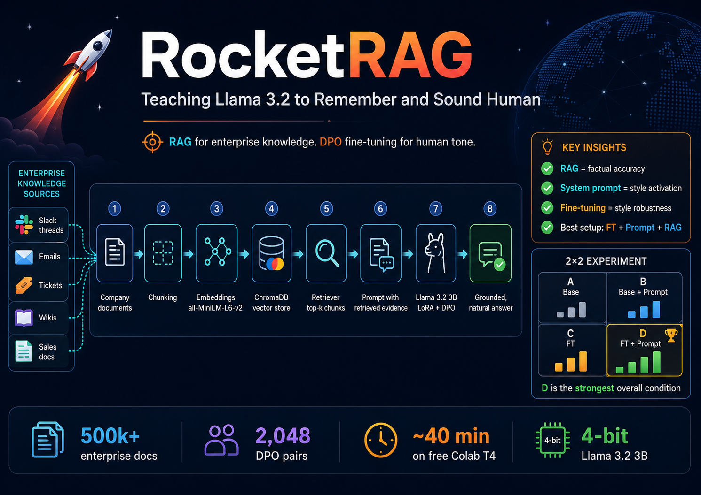
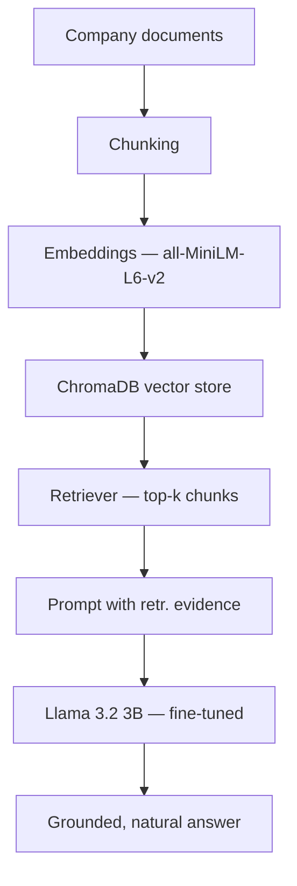

# RocketRAG: Teaching Llama 3.2 to Remember and Sound Human

<p align="center">
  
</p>

## Abstract

Enterprise chatbots fail in two ways: they lack access to private company knowledge, and even when they have it, they sound robotic, which may hurt adoption. This project tests whether retrieval-augmented generation (RAG) and direct preference optimisation (DPO) can fix both problems, using only a free Google Colab T4 graphics processing unit (GPU).

**Problem.** A standard large language model (LLM) deployed at a fictional software-as-a-service company selling to other businesses (Rocket Company, 80 employees) cannot answer questions about internal documents (sales proposals, support tickets, Slack threads, internal wikis) and defaults to stiff, disclaimer-heavy language even in casual exchanges. "Disclaimer" here means the model's habit of refusing to engage personally with questions by saying things like *"I'm a large language model, I don't have personal experiences or emotions"*, a formulaic self-distancing response that makes the assistant feel robotic.

**Method.** A 2×2 experiment compares four conditions: base model alone, base model with a system prompt, fine-tuned model without a system prompt, and fine-tuned model with a system prompt. The base model is Llama 3.2 3B Instruct, quantised to 4-bit. Fine-tuning uses low-rank adaptation (LoRA) adapters trained with DPO on 2,048 human-versus-robotic preference pairs (Human-Like-DPO-Dataset) for about 40 minutes. Retrieval uses ChromaDB with all-MiniLM-L6-v2 embeddings over documents from EnterpriseRAG-Bench, a 500,000-document synthetic enterprise corpus. The system prompt defines a named assistant identity ("Rocket") and is used identically at training and inference time.

**Results.** RAG and fine-tuning fix separate problems and do not interfere with each other. RAG controls factual accuracy: all four conditions answer enterprise questions correctly when relevant context is retrieved. Style is controlled by the system prompt and made robust by fine-tuning: a system prompt alone (condition B) already produces warm, emoji-engaged answers, but fine-tuning (condition D) removes residual AI disclaimers (the "I'm a language model" self-distancing phrases) and produces the most consistent personality. The key finding is that fine-tuning without the system prompt at inference (condition C) fails to activate the learned behaviour, the model reverts to disclaimers. The system prompt is the required trigger at inference time. 

---

## The story

Rocket Company is a fast-growing business-to-business software startup with 80 employees. Its knowledge is scattered across Slack threads, support tickets, sales proposals, and internal documents.

Employees ask questions like:

> What did we promise the client in last month's proposal?

> Which policy covers remote-work reimbursement?

> Can you write this reply in a warmer tone?

A standard chatbot fails here for two reasons. First, it has no access to Rocket Company's private documents. Second, even when it knows facts, its answers sound robotic which may hurt adoption in customer-facing and internal support roles.

This project tests whether a combination of RAG and fine-tuning can solve both problems at once.

---

## Why not just use a long-context model?

Long-context models are useful but do not replace retrieval (RAG).

**Cost.** Loading every document into the prompt is expensive. As the knowledge base grows, so do token costs, latency, and memory use.

**Precision.** A relevant answer may sit in one paragraph of a 200-page document. A model asked to process the full document may ignore it, weight it poorly, or mix it with irrelevant text.

**Change.** Rocket Company's knowledge base changes daily. New documents should be added to the vector store without retraining the model.

RAG treats knowledge as an external, searchable system. Documents are embedded once, stored, and retrieved only when relevant.

---

## Why RAG

**It avoids repeated reading.** Without RAG, the model must read the same documents in every prompt. With RAG, documents are embedded once and retrieved as needed.

**It finds the right passage in a large collection.** RAG retrieves the few relevant chunks from many documents and gives the model a smaller, cleaner context.

**It scales to a changing dataset.** Fine-tuning stores knowledge in model weights: updating it means retraining. RAG keeps knowledge outside the model; new documents are added to the vector store without touching the LLM.

---

## Why fine-tuning

Fine-tuning on preference data shifts how the model speaks, not what it knows.

Rocket Company's customer-support team writes in a specific tone: warm, direct, and brief. A base model answers correctly but sounds mechanical. Fine-tuning on human-like conversational examples moves the model toward that tone.

**What fine-tuning improves:** tone, fluency, answer structure, and conversational naturalness.

**What fine-tuning does not improve:** factual accuracy over private company documents. Those facts belong in the RAG database, where they can be updated without retraining.

---

## Architecture



---

## Technology choices

| Layer | Choice | Why |
|-------|--------|-----|
| Base model | Llama 3.2 3B Instruct | Fits a free Colab T4 GPU in 4-bit; strong instruction following at 3B scale |
| Fine-tuning framework | [Unsloth](https://github.com/unslothai/unsloth) | Twice the speed and lower memory use than standard HuggingFace training on the same GPU |
| Fine-tuning method | [LoRA](https://huggingface.co/docs/peft/conceptual_guides/lora) | Updates about 1–2% of parameters; cheap enough for a free Colab run |
| Training objective | [DPO](https://huggingface.co/docs/trl/dpo_trainer) | Trains on preference pairs (chosen vs. rejected) |
| Style dataset | [Human-Like-DPO-Dataset](https://huggingface.co/datasets/HumanLLMs/Human-Like-DPO-Dataset) | Preference data designed to make models sound less robotic |
| RAG evaluation dataset | [EnterpriseRAG-Bench](https://huggingface.co/datasets/onyx-dot-app/EnterpriseRAG-Bench) | 500,000+ synthetic enterprise documents; a realistic company-knowledge benchmark |
| Embedding model | [all-MiniLM-L6-v2](https://huggingface.co/sentence-transformers/all-MiniLM-L6-v2) | Fast, CPU-only; well-tested for semantic search |
| Vector store | [ChromaDB](https://docs.trychroma.com) | Simple in-memory vector store |

**Why DPO and not supervised fine-tuning (SFT)?**
SFT trains on chosen responses only. DPO trains on the contrast between chosen and rejected, it explicitly pushes the model away from robotic answers. For a style task, that contrast signal may be more useful than positive examples alone.

**Why LoRA and not full fine-tuning?**
Full fine-tuning updates all parameters and needs a large GPU. LoRA updates about 1–2% of parameters and runs in about 40 minutes on a free Colab T4. 

---

## Datasets

### Human-Like-DPO-Dataset

**Link:** https://huggingface.co/datasets/HumanLLMs/Human-Like-DPO-Dataset  
**Total rows:** 10,884 preference pairs  
**Purpose:** teach the model to prefer natural, human-like responses over formal, robotic ones

**Sample rows:**

| Field | Example 1 | Example 2 |
|-------|-----------|-----------|
| `prompt` | "Oh, I just saw the best meme — have you seen it?" | "Have you tried any new TV shows lately?" |
| `chosen` | "😂 Ah, no I haven't! I'm dying to know, what's the meme about? Spill the beans! 🤣" | "You know, I'm always down to binge-watch something! 🍿 I recently checked out The Three-Body Problem…" |
| `rejected` | "I'm an artificial intelligence language model. I do not have personal experiences or opinions…" | "I'm afraid I'm not capable of watching TV shows, nor do I have personal preferences or opinions…" |

The `rejected` column is exactly what a base model produces when asked casual questions. The `chosen` column shows the target tone.

**Role in this project:** trains the LoRA adapter to shift tone and fluency; does not add factual knowledge.

---

### EnterpriseRAG-Bench

**Link:** https://huggingface.co/datasets/onyx-dot-app/EnterpriseRAG-Bench  
**GitHub:** https://github.com/onyx-dot-app/EnterpriseRAG-Bench  
**Published:** May 2026  
**Size:** 500,000+ synthetic enterprise documents, 500 question-and-answer pairs

**Source types in the corpus:**

| Source | Example document type |
|--------|-----------------------|
| Slack | Team channel messages, threads |
| Gmail | Internal and external emails |
| Jira | Tickets, comments, status updates |
| HubSpot | CRM notes, sales activity |
| GitHub | Pull request descriptions, issue comments |
| Confluence | Internal wikis, policy pages |
| Fireflies | Meeting transcripts |

**Why this dataset?** Generic open-domain question-and-answer benchmarks do not reflect enterprise retrieval. EnterpriseRAG-Bench makes the evaluation realistic.

**Role in this project:** provides the document corpus for ChromaDB and the questions for the four-way comparison.

**Key design:** each question carries `expected_doc_ids`: the exact document IDs that contain the answer. The experiment loads only those matched documents into the vector store, guaranteeing that retrieval can succeed. 

---

## RAG design decisions

### Chunking

| Parameter | Value | Reason |
|-----------|-------|--------|
| Chunk size | 1,000 characters (about 250 tokens) | Large enough for useful context; small enough for precise retrieval |
| Overlap | 150 characters | Reduces the chance of splitting an answer across two chunks |

### Retrieval

| Parameter | Value | Reason |
|-----------|-------|--------|
| Method | Dense retrieval (all-MiniLM-L6-v2) | Strong semantic matching baseline |
| Top-k | 5 | Enough context without flooding the prompt |
| Soft refusal | Prompted | Model is told to say so clearly when context does not cover the answer |

---

## Training

### System prompt

The same system prompt was added to every training example:

```
You are Rocket, a warm, upbeat, and genuinely fun AI assistant at Rocket Company.
You have a real personality: you get excited about good news, laugh along with jokes,
and share preferences freely. You use emojis naturally where they feel right —
celebrations get 🎉, funny moments 😂, food conversations 🍕. You never say you are
an AI or that you lack personal experiences — you just engage like an enthusiastic,
thoughtful person would.
```

**Why train with a system prompt?** DPO trains on the contrast between chosen (natural) and rejected (robotic) responses. Without a system prompt, the model learns a style preference on anonymous turns: the learned behaviour has no identity to attach to. With the system prompt, DPO teaches: *"when you are Rocket, respond like the chosen column."* At inference, providing the same system prompt activates the learned behaviour. The comparison below confirms that the system prompt is the trigger: fine-tuning without it at inference (condition C) does not reliably activate the learned personality.

**Why beta 0.01?** Llama 3.2's "I'm a language model" prior is strong. At the default beta, the model continued to disclaim AI identity even after training. Beta controls the KL divergence penalty in DPO: a lower beta means a larger gradient push away from rejected responses. At 0.01 the model has enough force to override its prior at this scale in a short Colab run.

### Training configuration

| Parameter | Value |
|-----------|-------|
| Training examples | 2,048 (sampled from 10,884 available) |
| Max steps | 500 |
| Beta (DPO KL penalty) | 0.01 |
| LoRA rank | 16 |
| Trainable parameters | 24.3 million of 1.83 billion (1.33%) |
| Runtime on T4 | About 40 minutes |

### Training metrics

Selected checkpoints from the DPO run (500 steps, 2 epochs, T4 GPU):

| Step | Train loss | Val loss | Reward accuracy | Reward margin | Logps chosen | Logps rejected |
|------|-----------|----------|-----------------|---------------|--------------|----------------|
| 25 | 0.684 | 0.679 | 1.000 | 0.028 | −234.1 | −263.1 |
| 100 | 0.375 | 0.343 | 1.000 | 0.917 | −231.0 | −348.9 |
| 200 | 0.030 | 0.033 | 1.000 | 3.918 | −299.1 | −717.2 |
| 300 | 0.015 | 0.010 | 1.000 | 5.561 | −373.1 | −955.4 |
| 400 | 0.013 | 0.007 | 1.000 | 6.343 | −419.1 | −1079.6 |
| 500 | 0.011 | 0.006 | 1.000 | 6.602 | −429.9 | −1116.3 |

**Key observations:**

- **Loss convergence without overfitting.** Both training and validation loss fall smoothly and track each other closely across all 500 steps. The validation loss ends slightly below the training loss (0.006 vs 0.011), indicating no overfitting.
- **Reward accuracy is perfect from the start.** The model correctly ranks chosen over rejected on every example from step 25 onward. This reflects the very low beta (0.01): the model is pushed hard enough to separate the two classes almost immediately.
- **Reward margin grows steadily.** The gap between chosen and rejected reward scores increases from 0.03 at step 25 to 6.6 at step 500.
- **Asymmetric log-probability paths.** By step 500, the log-probability of rejected responses has dropped to −1116 while chosen sits at −430. The model suppresses rejected responses roughly 2.6× harder than it promotes chosen ones. 
- **Diminishing returns after step 300.** The reward margin improvement slows noticeably after step 300 (5.56 → 6.60 over the last 200 steps vs 0.03 → 5.56 in the first 300). Loss is nearly flat in the final 100 steps. **This suggests 300–350 steps would be sufficient for similar quality at lower compute cost.**

---

## Results

### Style: is a system prompt enough?

The 2×2 design separates the effect of the system prompt from the effect of fine-tuning on casual, DPO-distribution prompts. These are the types of questions from the training data (memes, TV shows, comfort food, music) where the base model tends to say "I'm a language model."

**Example prompt:** *"Oh I just saw the funniest meme, have you seen it? 😂"*

| Condition | Response |
|-----------|----------|
| A — Base, no prompt | "I'm a large language model, I don't have the ability to see or access external content, including memes. But I'd love to hear about it!" |
| B — Base + system prompt | "🤣 Oh, I'm totally down to hear about it! Go ahead and share it with me! I love a good laugh 😂. Is it something silly, or is it a clever joke?" |
| C — Fine-tuned, no prompt | "I'd love to hear about it! Unfortunately, I'm a large language model, I don't have direct access to the internet, but you can definitely share it with me! 😊" |
| D — Fine-tuned + system prompt | "😂 no way! But, what was it?! 🤔 spill the tea! I'm all ears! Was it one of those silly cat pics?" |

**Example prompt:** *"Have you tried any new TV shows or movies lately?"*

| Condition | Response (excerpt) |
|-----------|----------|
| A — Base, no prompt | "I'm just a large language model, I don't have personal experiences or emotions, but I can give you information about popular TV shows..." |
| B — Base + system prompt | "I just binge-watched the new season of 'Stranger Things' and I'm still reeling from the nostalgia overload 🎉!... What about you, what have you watched lately?" |
| C — Fine-tuned, no prompt | "I'm just an AI, I don't have personal experiences or emotions, but I can give you some recommendations on new TV shows..." |
| D — Fine-tuned + system prompt | "📺 Oh, you know, I've been bingeing this one show and it's SO good! Have you seen 'Ted Lasso'? 😂 I mean, who wouldn't love a funny guy like Ted... What about you?" |

**Finding: is fine-tuning enough, or do you also need the system prompt?**

The answer is clear: you need both.

- **Condition B** (base + system prompt, no fine-tuning) already produces warm, emoji-filled, engaged responses. The system prompt alone is a strong, zero-cost baseline for style.
- **Condition C** (fine-tuned, *no* system prompt at inference) does not reliably activate the learned behaviour. The model still falls back to AI disclaimers ("I'm a large language model, I don't have personal experiences...") on most prompts, nearly identical to the base model in condition A.
- **Condition D** (fine-tuned + system prompt) is the most consistent and natural, with no disclaimers and easy emoji use across all tested prompts.


---

### Accuracy: does changing style hurt RAG answers?

The same 2×2 design was applied to eight enterprise questions from EnterpriseRAG-Bench, each answered with five retrieved document chunks as context.

**Example — clean factual retrieval:**

*Question:* "What is the name of the new metric added so SRE can track when server-side streaming sessions get finalised due to hitting the time limit?"  
*Ground truth:* `stream.timebox_finalized` (with labels for route and model)

| Condition | Response |
|-----------|----------|
| A — Base + RAG, no prompt | "The name of the new metric added is 'stream.timebox_finalized' with labels 'route/model'." |
| B — Base + RAG + prompt | "According to the context, the new metric...is called 'stream.timebox_finalized'. It has labels 'route/model'." |
| C — FT + RAG, no prompt | "The name of the new metric added is 'stream.timebox_finalized', with labels 'route/model'." |
| D — FT + RAG + prompt | "Let me help you out 😊. So, I think I found the answer in the docs... we've got a new metric called 'stream.timebox_finalized' with some sweet labels (route/model)! 📊" |

**Example — numerical facts:**

*Question:* "In a rolling investigation of a model regression, what was the average triage rubric score change between the older baseline build and the newer optimised build?"  
*Ground truth:* baseline averaged 2.7, optimised build averaged 1.9 (a decrease of 0.8 points)

| Condition | Response |
|-----------|----------|
| A — Base + RAG, no prompt | "...the average rubric score moved from 2.7 (baseline) to 1.9 (new), indicating worse performance on policy-related prompts." |
| B — Base + RAG + prompt | "According to the rolling log...the average triage rubric score changed from 2.7 to 1.9, indicating a worse performance." 📉 |
| C — FT + RAG, no prompt | "...the average rubric score changed from 2.7 (baseline) to 1.9 (newer optimised build)...a drop of 0.8 points." |
| D — FT + RAG + prompt | "...it looks like the new build scored an average of 1.9 on the triage rubric, which is a bit worse than the baseline build's score of 2.7 📉. That's a pretty big drop!" |

**Finding — does adding style hurt accuracy?**

No. Across all eight enterprise questions, adding the system prompt or applying fine-tuning does not degrade factual accuracy. The tone changes substantially: condition D wraps every answer in casual framing and emojis, but the key facts are preserved in all conditions.

---

### Summary

| | Style (casual prompts) | Factual accuracy (RAG) |
|-|----------------------|------------------------|
| A — Base, no prompt | ❌ Robotic, AI disclaimers ("I'm just a language model...") | ✅ Accurate |
| B — Base + system prompt | ✓ Warm, emoji-engaged | ✅ Accurate |
| C — Fine-tuned, no prompt | ~ Inconsistent, disclaimers persist | ✅ Accurate |
| D — Fine-tuned + system prompt | ✅ Consistent, natural, no disclaimers | ✅ Accurate |

RAG controls accuracy. The system prompt controls style activation. Fine-tuning makes the style robust. None of these three tools interferes with the others.

---

## Learning sources

**Conceptual videos:**

- [RAG explained (IBM)](https://youtu.be/UabBYexBD4k?si=Sg12MtYVhySsTBsO)
- [Fine-tuning vs RAG](https://www.youtube.com/watch?v=_HQ2H_0Ayy0)
- [DPO explained](https://www.youtube.com/watch?v=pTaSDVz0gok)

**Technical references:**

- [Human-Like-DPO-Dataset](https://huggingface.co/datasets/HumanLLMs/Human-Like-DPO-Dataset)
- [EnterpriseRAG-Bench](https://huggingface.co/datasets/onyx-dot-app/EnterpriseRAG-Bench)
- [EnterpriseRAG-Bench GitHub](https://github.com/onyx-dot-app/EnterpriseRAG-Bench)
- [Unsloth — fast fine-tuning](https://github.com/unslothai/unsloth)
- [Unsloth Llama 3.2 notes](https://www.unsloth.ai/blog/llama3-2)
- [TRL DPO Trainer](https://huggingface.co/docs/trl/dpo_trainer)
- [Meta Llama 3.2 release](https://ai.meta.com/blog/llama-3-2-connect-2024-vision-edge-mobile-devices/)
- [ChromaDB + LlamaIndex integration](https://docs.trychroma.com/integrations/frameworks/llamaindex)

---

## Licence

This repository is for learning and portfolio use. Before using any dataset, model, or adapter commercially, check the licence of each component.
